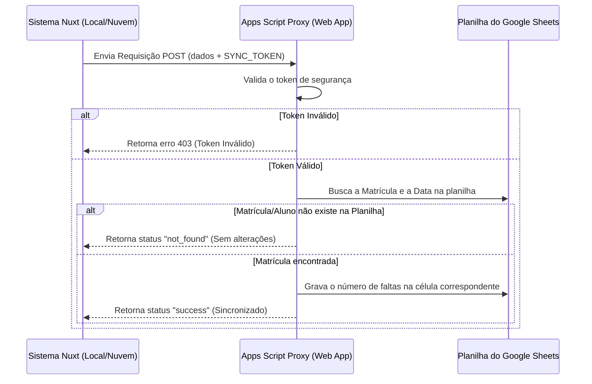

# Guia de Integração com o Google Sheets

Este guia explica detalhadamente como conectar o sistema de controle de presença ao Google Sheets. A integração permite que o sistema envie presenças e faltas em tempo real para uma planilha do Google Drive, bem como importe a estrutura de alunos para o banco de dados.

---

##  Como Funciona a Integração?

A integração utiliza o **Google Apps Script** atuando como um "Proxy" seguro:



---

##  Passo a Passo para Configuração

### Passo 1: Criar e Obter o ID da Planilha do Google
1. Crie uma nova planilha no seu Google Sheets.
2. Copie o **ID da Planilha** diretamente da barra de endereços do seu navegador. O ID é o código alfanumérico extenso localizado entre `/d/` e `/edit`:
   * *Exemplo de URL:* `https://docs.google.com/spreadsheets/d/1B7z8X9yA5s_dEfgSU_123456789abc/edit`
   * *ID da Planilha correspondente:* `1B7z8X9yA5s_dEfgSU_123456789abc`

---

### Passo 2: Configurar o Google Apps Script na Planilha
1. Com a sua planilha aberta no navegador, vá no menu superior e clique em **Extensões** > **Apps Script**.
2. No menu lateral esquerdo do painel do Apps Script, clique no ícone de engrenagem (**Configurações do Projeto**).
3. Role a página de configurações até a seção final **Propriedades do script** e clique em **Adicionar propriedade do script**.
   * Em **Propriedade**, digite exatamente: `SYNC_TOKEN`
   * Em **Valor**, insira a sua senha de integração (ex: `token123`).
   * Clique em **Salvar propriedades do script**.
4. Retorne para a tela de desenvolvimento clicando no ícone de chaves de código (**Editor** `< >`) no menu lateral esquerdo.
5. Apague todo o conteúdo do arquivo `Código.gs` e substitua-o pelo seguinte script:

```javascript
// O script lê a senha de integração salva nas configurações internas do projeto
const SECURITY_TOKEN = PropertiesService.getScriptProperties().getProperty('SYNC_TOKEN');

function doPost(e) {
  var lock = LockService.getScriptLock();
  lock.tryLock(10000); // Evita concorrência e conflitos de escrita na planilha
  
  try {
    var data = JSON.parse(e.postData.contents);
    
    // Validação de token de segurança
    if (data.token !== SECURITY_TOKEN) {
      return response({ result: "error", message: "Token inválido" });
    }

    var ss = SpreadsheetApp.openById(data.spreadsheetId);
    var sheet = ss.getSheets()[0]; // Seleciona a primeira aba da planilha

    // Ação 1: Inicializar / Exportar Alunos
    if (data.action === "initialize") {
      sheet.clear();
      var header = ["Matricula", "Nome"].concat(data.dates || []);
      sheet.appendRow(header);
      if (data.students) {
        data.students.forEach(function(aluno) {
          sheet.appendRow([aluno.matricula, aluno.nome]);
        });
      }
      sheet.getRange(1, 1, 1, header.length).setFontWeight("bold").setBackground("#f3f4f6");
      return response({ result: "success", message: "Estrutura inicializada com sucesso!" });
    }

    // Ação 2: Atualização de Faltas em Tempo Real
    var values = sheet.getDataRange().getDisplayValues();
    var header = values[0];
    
    // Localiza o índice da coluna correspondente à data
    var colIndex = -1;
    for (var j = 0; j < header.length; j++) {
      if (header[j].toString().trim() == data.data.toString().trim()) {
        colIndex = j + 1;
        break;
      }
    }
    if (colIndex == -1) return response({ result: "error", message: "Data não encontrada na planilha" });

    // Localiza a linha correspondente à matrícula do aluno
    var rowIndex = -1;
    for (var i = 0; i < values.length; i++) {
      if (values[i][0].toString().trim() == data.matricula.toString().trim()) {
        rowIndex = i + 1;
        break;
      }
    }
    
    // Grava as faltas se o aluno for encontrado
    if (rowIndex != -1) {
      sheet.getRange(rowIndex, colIndex).setValue(data.status);
      return response({ result: "success" });
    }
    
    return response({ result: "not_found", message: "Matrícula do aluno não localizada na planilha" });

  } catch (f) {
    return response({ result: "error", message: f.toString() });
  } finally {
    lock.releaseLock();
  }
}

// Formata a resposta da API como JSON
function response(obj) {
  return ContentService.createTextOutput(JSON.stringify(obj)).setMimeType(ContentService.MimeType.JSON);
}
```

---

### Passo 3: Implantar o Apps Script como Aplicativo Web
Para expor a API que o sistema Nuxt usará, crie uma implantação pública:
1. No painel do Apps Script, clique no botão azul **Implantar** (canto superior direito) > **Nova implantação**.
2. Clique no ícone de engrenagem ao lado de "Selecionar tipo" e escolha **App da web**.
3. Defina as seguintes opções obrigatórias:
   * **Executar como:** Selecione **Eu** (sua conta do Google).
   * **Quem tem acesso:** Selecione **Qualquer pessoa** (necessário para que a API receba chamadas externas. A segurança é feita internamente pelo `SYNC_TOKEN`).
4. Clique em **Implantar**.
5. O Google abrirá uma janela pop-up solicitando autorização. Clique em **Autorizar acesso**, selecione sua conta Google, clique no link pequeno **Avançado**, selecione **Acessar Projeto (inseguro)** e confirme a autorização.
6. Copie a **URL do app da web** gerada na tela (esta URL termina com `/exec`).

---

### Passo 4: Atualizar as Configurações locais no arquivo `.env`
1. No seu computador, abra a pasta raiz do sistema de controle de presença.
2. Abra o arquivo `.env` e configure o seu token e o link da API gerados nos passos anteriores:
   ```env
   DATABASE_URL="file:./prisma/database.db"
   SYNC_TOKEN="A_SUA_SENHA_ESCOLHIDA_AQUI"
   LINK_PROXY="A_URL_DO_APP_DA_WEB_QUE_VOCE_COPIOU_NO_PASSO_3"
   ```
3. Reinicie seu servidor de desenvolvimento executando novamente: `npm run dev`.

---

### Passo 5: Vincular a Planilha e Exportar Alunos (IMPORTANTE ⚠️)

> [!IMPORTANT]
> **Por que este passo é obrigatório?**
> A sincronização em tempo real busca a matrícula do aluno para saber em qual linha deve gravar a falta. Se a planilha estiver em branco (sem os nomes dos alunos), o sistema **não conseguirá** sincronizar as faltas em tempo real. Você deve exportar os alunos uma primeira vez.

1. No painel administrativo do sistema de presença, vá em **Gerenciar Turmas** (`http://localhost:3000/admin/turmas`).
2. Clique no botão de edição de vínculo da turma desejada.
3. Insira o **ID da Planilha** (obtido no Passo 1) e salve.
4. Clique no botão **Exportar para Google** (com o ícone de nuvem).
5. O sistema enviará automaticamente o cabeçalho de datas e cadastrará todos os alunos (nome e matrícula) nas linhas corretas da sua planilha.
6. **Pronto!** Agora, qualquer presença ou falta alterada no Dashboard do sistema atualizará a célula correspondente no Google Sheets no mesmo instante.

---

##  Resolução de Problemas (Troubleshooting)

| Sintoma | Causa Comum | Como Corrigir |
| :--- | :--- | :--- |
| **Faltas alteradas no sistema não atualizam o Sheets** | Planilha está em branco (sem alunos cadastrados nas linhas). | No menu "Gerenciar Turmas", clique no modal da turma e clique no botão **Exportar para Google** para preencher os alunos. |
| **Erro "Token inválido" retornado no console** | O `SYNC_TOKEN` do arquivo `.env` não é idêntico à propriedade `SYNC_TOKEN` no Apps Script. | Certifique-se de que os tokens no `.env` e nas Propriedades de Script da planilha sejam exatamente iguais (atenção a maiúsculas/minúsculas). |
| **A data da coluna na planilha não é atualizada** | A coluna correspondente à data atual (ex: `28/05`) não existe na primeira linha da planilha. | Adicione a data no formato correto na primeira linha (ex: `28/05`) ou clique em **Exportar para Google** para recriar o calendário de datas padrão. |
| **Erro ao conectar (Connection Refused ou Timeout)** | A URL no `LINK_PROXY` está incorreta ou desatualizada. | Certifique-se de que o link inserido no `.env` é exatamente a **URL do App da web** gerada na implantação (e que termina com `/exec`). Se alterar o script, lembre-se de criar uma "Nova versão" de implantação. |
